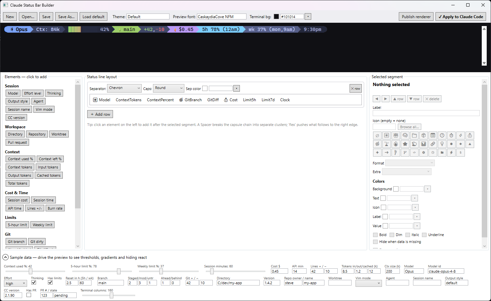

# Hack the Claude Status Bar

> **This is the web version — work in progress.** It brings the status line builder to the browser (Blazor WebAssembly) so anyone can design one online, on any OS. The original Windows desktop app lives at [Claude-Status-Bar-Builder](https://github.com/shanadev/Claude-Status-Bar-Builder); this repo is now canonical for the shared rendering core and renderer releases. README below still describes the desktop app until the web version ships.

> I wanted to visually build my status bar, man.

A Windows desktop app for designing your [Claude Code](https://code.claude.com) status line **visually** — click elements together, style every piece with truecolor and powerline separators, watch a live terminal preview react to sample data, then apply it to Claude Code with one click.



## How it works

Your design is saved as a **theme JSON**. A small console renderer (`StatusBar.Renderer`) reads the session JSON that Claude Code pipes to your status line command on stdin, applies the theme, and prints ANSI rows. The Builder's preview and the real renderer share the same rendering code (`StatusBar.Core`), so what you see in the app is exactly what your terminal gets.

```
┌────────────┐  theme.json  ┌────────────────────┐  ANSI rows  ┌─────────────┐
│ Builder UI │ ───────────► │ StatusBar.Renderer │ ──────────► │ Claude Code │
└────────────┘              └────────────────────┘             └─────────────┘
                     session JSON on stdin ▲
```

**Apply to Claude Code** publishes the renderer, saves your theme, and writes the `statusLine` block into `~/.claude/settings.json` (backing up the old one first).

## Features

- **36 element types** across Session (model, effort, thinking, output style, agent, vim mode…), Workspace (directory, repo, worktree, PR), Context window (used %, remaining, token counts), Cost & Time (session $, durations, lines +/-, burn rate $/hr), Rate limits (5-hour and weekly, with reset countdowns), Git (branch, dirty counts, ahead/behind, diff lines), Extras (clock, date, project version, animated spinner), plus literal text and flex spacers.
- **Powerline styling** — chevron / round / slant / flame separators and end caps with automatic color chaining, capsule or flat looks, multi-row layouts.
- **Full truecolor** — every part of every segment (icon, label, value; foreground and background) takes a full-RGB picker or the 16 scheme-following ANSI colors.
- **Icon browser** — 12,678 searchable icons: 1,914 emoji indexed by CLDR keywords (search "dino", get 🦖) and 10,764 Nerd Font glyphs by official name.
- **Progress bars** — block/shade/braille/custom character sets, smooth sub-character eighths, per-cell gradients, threshold color ramps (green → yellow → red as context fills).
- **Live preview** — a real xterm.js terminal with sample-data controls, so you can drag the context slider and watch your thresholds, gradients, and hide-rules react before anything touches your config.
- **Fast & graceful renderer** — git info is cached (5s TTL, keyed by session), absent fields hide their segments instead of erroring, and running the exe by hand shows a demo render instead of hanging on stdin.

## Requirements

- Windows 10/11
- [.NET 10 SDK](https://dotnet.microsoft.com/) to build
- [WebView2 Runtime](https://developer.microsoft.com/microsoft-edge/webview2/) for the preview (preinstalled on Windows 11)
- A [Nerd Font](https://www.nerdfonts.com/) set as your terminal font if you use glyph icons (the app bundles CaskaydiaCove NF Mono for its own preview, so the Builder works either way)

## Build & run

```
dotnet build StatusBarBuilder.slnx
src\StatusBar.Builder\bin\Debug\net10.0-windows\StatusBar.Builder.exe
```

Design your bar, then hit **Apply to Claude Code**. That's it — your next Claude Code session shows the new status line.

To try the renderer on its own:

```
StatusBar.Renderer.exe --demo              # render your theme with sample data
cmd /c "type test-input.json | StatusBar.Renderer.exe mytheme.json"
```

(Use `cmd`'s `type` for piping, not PowerShell 5.1 — PS re-encodes and mangles UTF-8.)

## Wiring settings.json manually

The **Apply to Claude Code** button does this for you, but the generated block looks like:

```json
{
  "statusLine": {
    "type": "command",
    "command": "C:/path/to/StatusBar.Renderer.exe C:/path/to/theme.json",
    "refreshInterval": 5
  }
}
```

Forward slashes matter — on Windows, Claude Code runs the command through Git Bash when installed, which eats backslashes.

## Project layout

| Path | What it is |
|---|---|
| `src/StatusBar.Core` | Theme model, element registry, ANSI/segment rendering, composer — shared by preview and renderer |
| `src/StatusBar.Renderer` | Console exe Claude Code runs: stdin JSON → ANSI rows (plus git gathering & caching) |
| `src/StatusBar.Builder` | WPF designer app with xterm.js preview (WebView2) |
| `test-input.json` | Sample of the JSON Claude Code pipes to status line commands |

## License

GPL-3.0 — see [LICENSE](LICENSE). Bundled third-party components (xterm.js, the CaskaydiaCove Nerd Font, and icon metadata derived from Nerd Fonts and Unicode CLDR) remain under their own licenses — see [THIRD-PARTY-NOTICES.md](THIRD-PARTY-NOTICES.md).

---

*Designed and built with [Claude Code](https://code.claude.com).*
