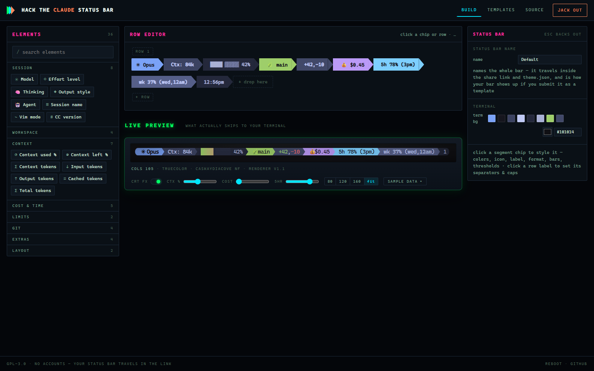

# Hack the Claude Status Bar

> I wanted to visually build my status bar, man.

Design your [Claude Code](https://code.claude.com) status line **in the browser** — click
elements together, style every piece with truecolor and powerline separators, watch a real
terminal preview react to sample data, then jack out with an installer. No accounts:
**the theme travels in the link**.

**Live site:** [hackthestatusbar.dev](https://hackthestatusbar.dev)



## How it works

The builder runs entirely client-side (Blazor WebAssembly). Your design is a **theme JSON**;
share links carry it compressed in the URL fragment, so nothing is uploaded unless you
deliberately submit your bar to the templates gallery. On your
machine, a small console renderer reads the session JSON Claude Code pipes to your status
line command on stdin, applies the theme, and prints ANSI rows. The browser preview and the
real renderer share the same rendering code (`StatusBar.Core`), so what you see on the site
is exactly what your terminal gets.

```
┌──────────────────┐  theme (link / json)  ┌────────────────────┐  ANSI rows  ┌─────────────┐
│ builder (browser)│ ────────────────────► │ StatusBar.Renderer │ ──────────► │ Claude Code │
└──────────────────┘                       └────────────────────┘             └─────────────┘
                                    session JSON on stdin ▲
```

## Features

- **36 element types** across Session (model, effort, thinking, output style, agent, vim
  mode…), Workspace (directory, repo, worktree, PR), Context window (used %, remaining,
  token counts), Cost & Time (session $, durations, lines +/-, burn rate $/hr), Rate limits
  (5-hour and weekly, with reset countdowns), Git (branch, dirty counts, ahead/behind, diff
  lines), Extras (clock, date, project version, animated spinner), plus literal text and
  flex spacers.
- **Powerline styling** — chevron / round / slant / flame separators and end caps with
  automatic color chaining, capsule or flat looks, multi-row layouts.
- **Full truecolor** — every part of every segment (icon, label, value; foreground and
  background) takes a full-RGB picker or the 16 scheme-following ANSI colors.
- **Icon browser** — 12,678 searchable icons: 1,914 emoji indexed by CLDR keywords (search
  "dino", get 🦖) and 10,764 Nerd Font glyphs by official name.
- **Progress bars** — block/shade/braille/custom character sets, smooth sub-character
  eighths, per-cell gradients, threshold color ramps (green → yellow → red as context fills).
- **Live preview** — a real xterm.js terminal (WebGL renderer, CaskaydiaCove Nerd Font) with
  quick knobs and a full 30-field sample-data drawer, so you can drag the context slider and
  watch thresholds, gradients, and hide-rules react before anything touches your config.
- **Share links** — the whole theme, deflate-compressed into `#t=…`. Open someone's link and
  remix it; your work-in-progress also autosaves locally.
- **Templates gallery** — approved community bars at `/templates`, live-rendered from their
  actual theme JSON with their color palette shown as swatches. Jack one in whole, **steal
  just the colors** onto your own layout, or copy its share link. Submitting yours is one
  click — name, author, optional description, no account needed.
- **Fast & graceful renderer** — self-contained single binary, git info cached (5s TTL,
  keyed by session), absent fields hide their segments instead of erroring, and running it
  by hand shows a demo render instead of hanging on stdin.
- Skippable dial-up boot sequence, CRT bezel toggle, scanlines, and a certain amount of
  smarm. Everything respects `prefers-reduced-motion`. HACK THE PLANET.

## Get a status line installed

Three ways, all starting from the site's **JACK OUT** screen:

1. **One-liner** — copy the generated command for your OS. It carries the theme in an
   `SBB_THEME` env var and runs [`install.ps1`](src/StatusBar.Web/wwwroot/install.ps1) /
   [`install.sh`](src/StatusBar.Web/wwwroot/install.sh): drops the renderer + theme into
   `~/.claude/statusbar/` and patches the `statusLine` block in `~/.claude/settings.json`
   (backing up the old file first).
2. **Let Claude do it** — paste the generated prompt (theme link + a pointer to
   [INSTALL.md](INSTALL.md)) into Claude Code and it performs the install, asking before it
   touches settings.
3. **Manual** — decode/download the theme, grab a renderer binary from the
   [latest release](https://github.com/shanadev/Claude-Status-Bar-Builder-Web/releases/latest),
   wire up `settings.json` yourself. Every step is in [INSTALL.md](INSTALL.md).

### Renderer binaries

| Platform | Release asset |
|---|---|
| Windows x64 | `StatusBar.Renderer-win-x64.exe` |
| macOS Apple Silicon | `StatusBar.Renderer-osx-arm64` |
| Linux x64 | `StatusBar.Renderer-linux-x64` |

Other platforms: `dotnet publish src/StatusBar.Renderer -c Release -r <rid> --self-contained
-p:PublishSingleFile=true` builds the same thing anywhere the .NET 10 SDK runs.

A Nerd Font in your terminal is needed for glyph icons and powerline caps —
[nerdfonts.com](https://www.nerdfonts.com/). Try a binary by hand:

```
renderer --demo                                  # render your theme with sample data
cmd /c "type test-input.json | renderer.exe"     # Windows: cmd's type, not a PS 5.1 pipe (UTF-8)
cat test-input.json | ./renderer                 # macOS / Linux
```

## Templates

The [gallery](https://hackthestatusbar.dev/templates)
holds approved community bars, one full-width card each, rendered live at 80 columns from
the theme JSON itself. **Jack in** replaces your bar; **use this color palette** recolors
the bar you're building without touching its layout; **copy link** shares it. Submissions
go through the site's own moderated queue (no GitHub account, nothing public until
approved): a maintainer runs `dotnet run --project tools/StatusBar.Review`, sees each
pending bar rendered in the console, approves or rejects, and approved entries append to
`src/StatusBar.Web/wwwroot/templates.json` — one push and they're live.

## Build & run from source

Needs the [.NET 10 SDK](https://dotnet.microsoft.com/).

```
git clone https://github.com/shanadev/Claude-Status-Bar-Builder-Web
cd Claude-Status-Bar-Builder-Web
dotnet run --project src/StatusBar.Server --launch-profile http   # → http://localhost:5153
```

`StatusBar.Server` serves the WASM site and the template-submission API together (the dev
profile ships a `local-dev-token` admin token so the whole submit → review loop works on
localhost). `Dockerfile` builds the production image: the server published onto the aspnet
runtime — the container binds `$PORT`, so it deploys to Railway or any container host
as-is. The submission queue wants persistence: mount a volume at `/data` and set
`SUBMISSIONS_PATH=/data/submissions.jsonl` plus your own `SUBMIT_ADMIN_TOKEN`.

## Project layout

| Path | What it is |
|---|---|
| `src/StatusBar.Core` | Theme model, element registry, ANSI/segment rendering, composer — shared by site and renderer |
| `src/StatusBar.Renderer` | Console exe Claude Code runs: stdin JSON → ANSI rows (plus git gathering & caching) |
| `src/StatusBar.Web` | The site: Blazor WASM builder, xterm.js preview, export flows |
| `src/StatusBar.Server` | ASP.NET Core host: serves the site + the template-submission queue API |
| `tools/StatusBar.Review` | Maintainer console: renders queued submissions, yea/nay, appends approvals to `templates.json`, publishes |
| `src/StatusBar.Builder` | The original Windows WPF app ([maintained separately](https://github.com/shanadev/Claude-Status-Bar-Builder), kept here for shared history) |
| `design/cards` | Full Gibson design-system cards (source of truth for the look) |
| `INSTALL.md` | Canonical install guide — written so Claude Code can follow it |
| `test-input.json` | Sample of the JSON Claude Code pipes to status line commands |

## License

GPL-3.0 — see [LICENSE](LICENSE). Bundled third-party components (xterm.js, the
CaskaydiaCove Nerd Font, and icon metadata derived from Nerd Fonts and Unicode CLDR) remain
under their own licenses — see [THIRD-PARTY-NOTICES.md](THIRD-PARTY-NOTICES.md).

---

*Designed and built with [Claude Code](https://code.claude.com). Mess with the best, die
like the rest.*
